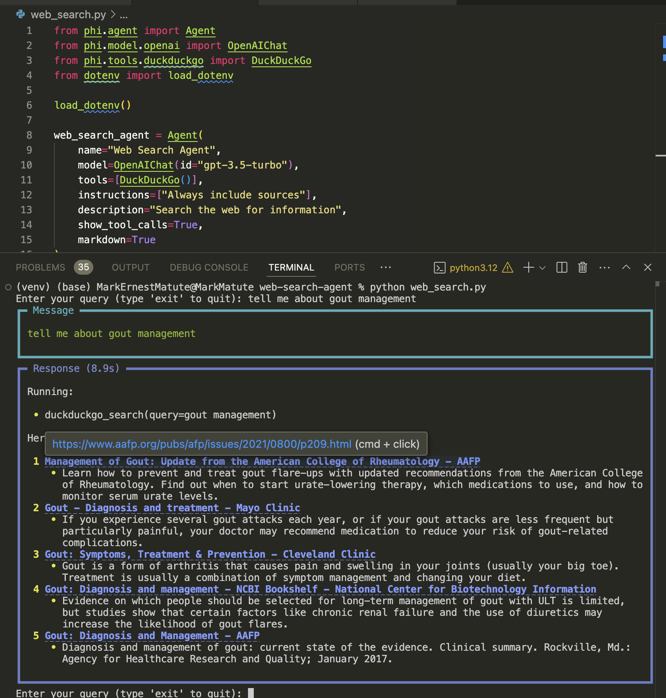

# Web Search Agent

## Screenshot
Here is a screenshot of the Web Search Agent in action:




## Prerequisites
Before installing Web Search Agent, ensure you have the following prerequisites:

- OpenAI API key

## Installation
To install Web Search Agent, follow these steps:

1. Clone the repository:
    ```bash
    git clone https://github.com/Inteligencia-Artificial-para-Filipinas/web-search-agent.git
    ```
2. Navigate to the project directory:
    ```bash
    cd web-search-agent
    ```
3. Install the required dependencies:
    ```bash
    pip install -r requirements.txt
    ```

## Usage
To start using Web Search Agent, run the following command:
```bash
python web_search.py
```
